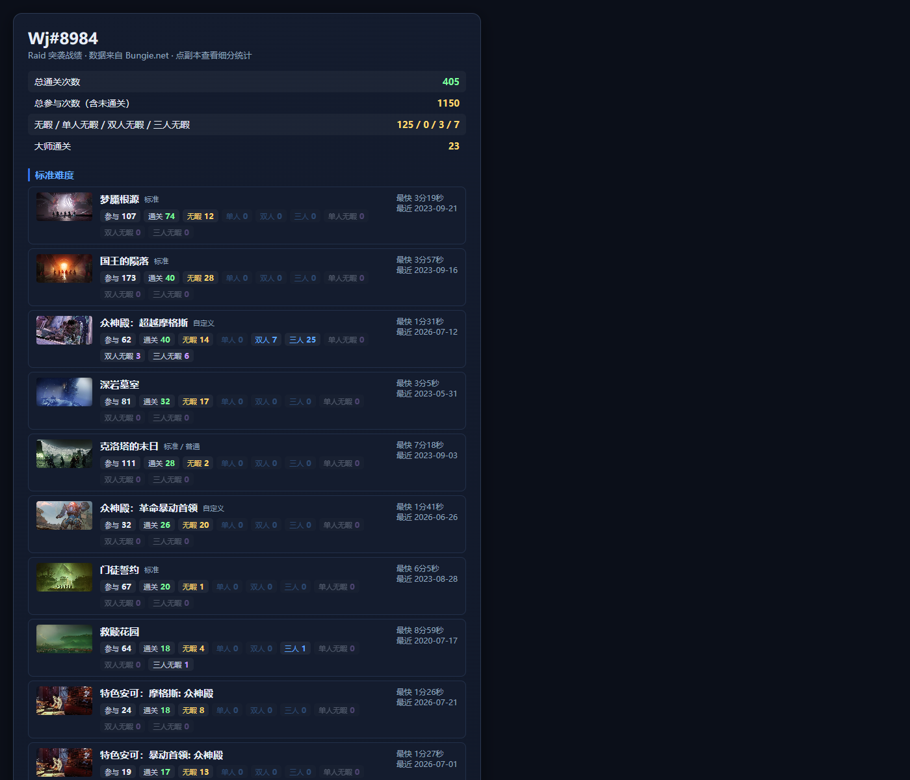
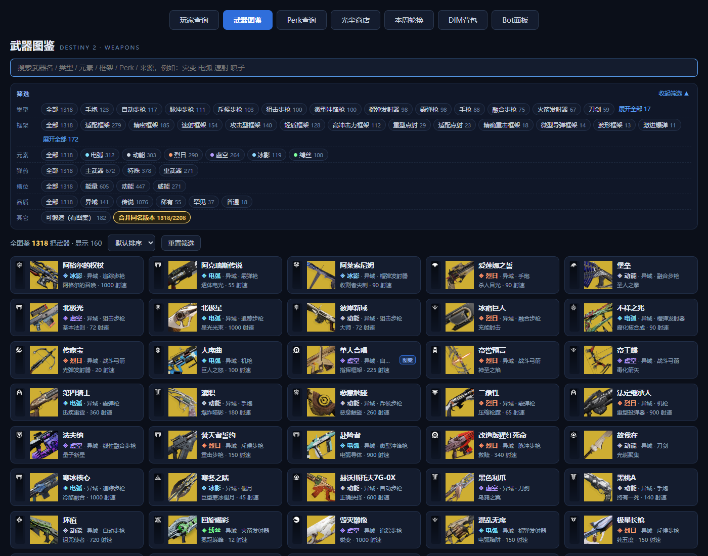
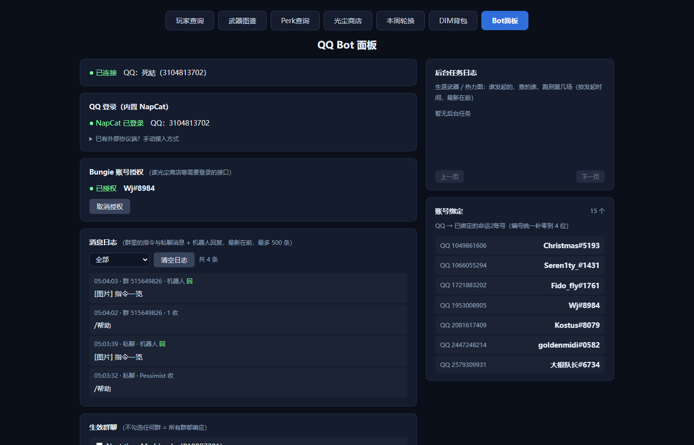
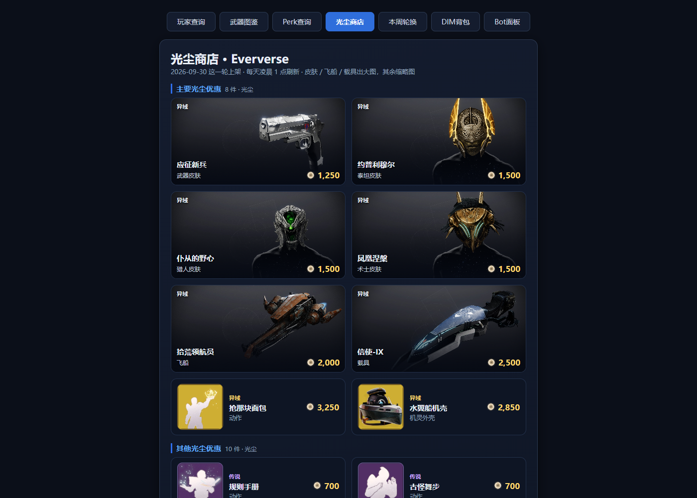
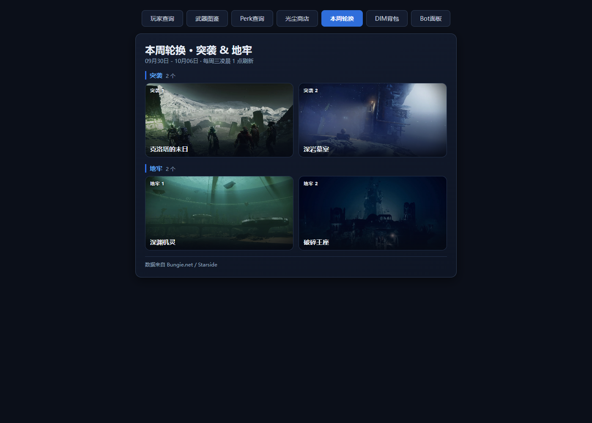
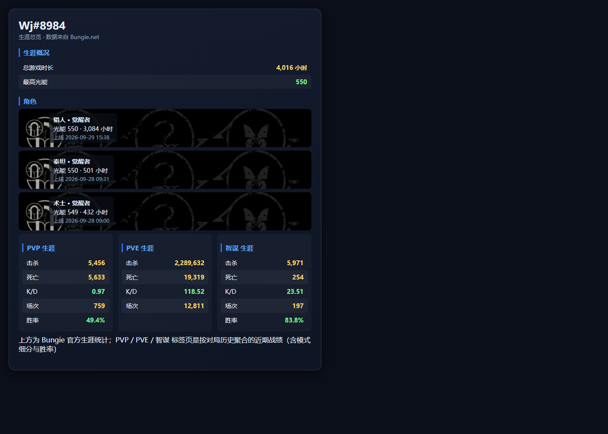
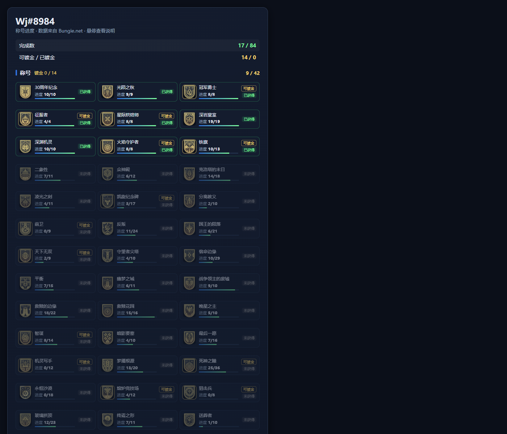
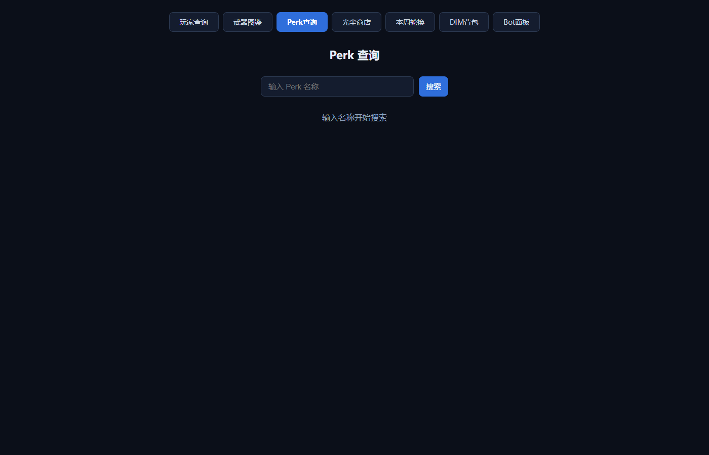
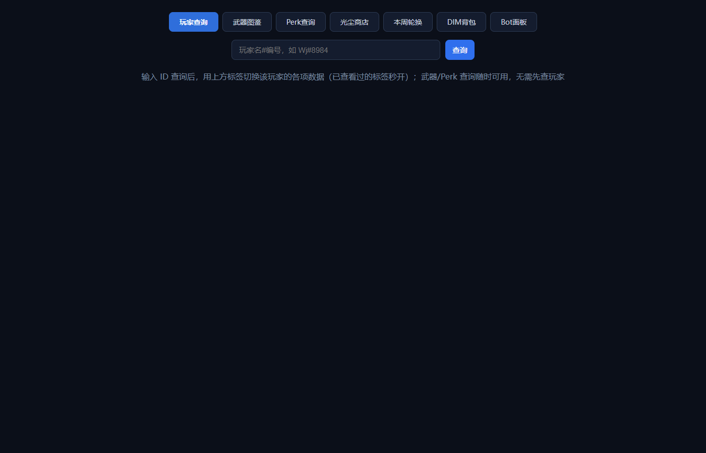

<div align="center">

# 雷尼克斯联合-1

**命运 2 本地查询站 + QQ 机器人**　·　一个 exe 同时搞定「网页战绩查询」和「群里丢指令出图」

原生窗口界面 · 全指令图片回复 · 内置 NapCat 扫码登录 · 无需外网服务器

[](https://www.python.org/)
[](https://nonebot.dev/)
[](https://github.com/botuniverse/onebot-11)
[](https://www.microsoft.com/windows)
[](https://bungie-net.github.io/)

</div>

---

## 它是什么

一个 **单机运行** 的命运 2 玩家数据工具，把三件事合到了一起：

| 模块 | 说明 |
| :--- | :--- |
| **网页查询站** | 本地 8900 端口，原生窗口（pywebview）打开，无需浏览器插件、不依赖任何公网服务 |
| **QQ 机器人** | 内置 NoneBot2 + OneBot V11 + NapCat，面板里扫码登录，群里发 `/生涯` 直接出图片卡片 |

数据全部来自 **Bungie 官方 API + Manifest（简体中文）**，本地索引 2208 把武器、三万多条物品定义，
查询走本地缓存，除了 Bungie 本身的请求外不碰任何第三方站点。

<div align="center">

<br><sub>▲ Raid 战绩卡：跨角色聚合，通关 / 无暇 / 大师 / 单人 / 双人 / 三人 / 单人无暇 / 双人无暇 / 三人无暇 全维度徽章，0 值自动压暗，标注该副本打过的难度与最快用时</sub>
</div>

---

## 功能一览

<table>
<tr><td width="50%" valign="top">

### 📊 玩家战绩
- **生涯面板** `/生涯`　逐赛季网格（赛季背景图 + 起止 / 天数 + 赛季等级）+ 分职业分模式时长 + 三模式生涯，秒级出图
- **总览**　光能 / 时长 / 三角色 + 三模式生涯速览
- **PVP / PVE / 智谋**　官方生涯统计（含胜率、精准击杀）+ 近期战绩（连胜连败 / KDA / 平均效率）+ **模式细分表**
- **Raid / 地牢**　跨角色聚合，八枚徽章逐副本一行，点击展开细分 + 按月筛选
- **战绩流**　全模式对局流，PvE 显示「通关 / 未通关」，PvP 显示「胜利 / 失败」
- **任意对局可点开** PGCR 详情：团队汇总、MVP、玩家横幅卡、武器明细

</td><td width="50%" valign="top">

### 📈 深度统计
- **生涯武器**　PVP / PVE 双口径，击杀 / 出场 / 场均 / 占比 / **精准击杀 / 爆头率**七列，顶部六块汇总（武器击杀 / 近战 / 手雷 / 大招）
- 可选**全生涯**或**指定赛季**；逐场 PGCR 首查 2～3 分钟，之后走缓存秒开
- **热力图**　按赛季分组的全历史月历，同赛季同色相、越亮玩得越久
- **称号**　x/y 进度条 + **可镀金 / 已镀金**单独区分（金色描边与实心徽章）
- **锻造**　按掉落来源分组，顶部永远留没集齐的组

</td></tr>
<tr><td colspan="2" valign="top">

### 🔫 图鉴与查询
- **武器图鉴** `/catalog`　全量 **2208 把**武器网格，六维度（类型 / 框架 / 元素 / 弹药 / 槽位 / 品质）**动态联动计数**筛选
- 跨字段搜索，认社区叫法（`喷子`→霰弹枪、`绿弹`→特殊弹药、`主手`→主武器…）
- 也认**英文名与台服繁体名**：`Fatebringer` / `Hand Cannon` / `手持加農砲` / `龍之氣息` 直接搜得到
- 默认**合并同名版本**（2208 条 → 1318 个名字），点卡片就地弹出详情层
- **武器详情**　Perk 分列**单选**，属性条实时联动（加成绿 / 削减红），Perk 悬停出精确数值浮层
- **异域催化**　145 把金枪，中文说明优先、社区英文兜底
- **Perk 查询** `/perks`　395 条中文数值说明，覆盖 2207/2208 把武器
- **光尘商店 / 本周轮换**　走 OAuth 读当日 vendor，轮换按官方里程碑 + Starside 配对表推算
- **护甲套装** `/armorsets`　56 套 2/4 件效果全中文数值（Starside），支持别名直达（一愿 / vog / kf …）
- **掉落表图** `/掉落`　Sayalarry 制作的突袭/地牢掉落和收集列表（B站专栏原版图），支持 `/ce掉落` `/ron掉落` 这类缩写直达

</td></tr>
<tr><td valign="top">

### 🤖 QQ 机器人
- **两条通道共用同一套指令**：NapCat 协议端（个人号，扫码登录）+ QQ 官方机器人
  （q.qq.com，出站 WS，不占端口），平台差异全收在 `bot_platform.py`
- 群里所有回复都是**图片卡片**（HTML 排版 + 无头浏览器截图，小日向式）
- 战绩类卡片**直接复用网页端排版**——改网页样式，机器人出图跟着变，不用维护两套
- 群内回复自动 `@` 发起人（官方通道由 `official_at_back` 控制），私聊不加
- 支持「引用某条消息 / @机器人 后再发指令」，也支持直接 `@机器人 武器名` 出卡
- **面板内置 NapCat 一键登录**：二维码直接显示在面板里，手机扫码即可，全程不用打开 NapCat WebUI
- **预设指令面板 + 单聊菜单已配好**（打 `/` 弹出的指令列表，小日向同款，每条带中文说明）：
  改清单重跑 `qq_official_panel.py --apply` 即同步，见下文「指令面板 / 单聊菜单」
- 面板带**后台任务进度条**（谁发起的 / 查到第几场 / 排队位次）与**消息日志**

</td><td valign="top">

### ⚙️ 工程细节
- **单文件 exe**　PyInstaller 打包，原生窗口，无 cmd 黑框，端口被占用自动顺延
- **事件循环隔离**　同时跑三个 loop（主界面 / Bungie 回跳 HTTPS / QQ bot），httpx 客户端与 Playwright 浏览器**按 loop 各持一份**
- **本地缓存**　PGCR 逐场落盘（上限 20000 场），生涯武器 / 热力图结果级缓存，再查秒开
- **任务串行队列**　长任务排队执行，避免被 Bungie 限流
- **离线自检**　`test_sweep.py` 57 项接口断言；`_rtest/` 下用无头 Edge 逐页 DOM 断言，**写请求全部 route 拦截，不打真实账号**

</td></tr>
</table>

---

## 界面预览

**武器图鉴** —— 2208 把武器 · 六维联动筛选 · 同名版本合并

<table>
<tr>
<td width="50%"><div align="center"><br><sub><b>武器图鉴</b>　2208 把武器 · 六维联动筛选</sub></div></td>
<td width="50%"><div align="center"><br><sub><b>Bot 面板</b>　扫码登录 · 后台任务进度 · 消息日志</sub></div></td>
</tr>
<tr>
<td><div align="center"><br><sub><b>光尘商店</b>　当日轮换商品</sub></div></td>
<td><div align="center"><br><sub><b>本周轮换</b>　突袭 + 固定配对推算</sub></div></td>
</tr>
<tr>
<td><div align="center"><br><sub><b>总览卡片</b>　群指令出图效果</sub></div></td>
<td><div align="center"><br><sub><b>称号卡片</b>　x/y 进度 + 可镀金 / 已镀金区分</sub></div></td>
</tr>
<tr>
<td><div align="center"><br><sub><b>Perk 查询</b>　中文精确数值 + 属性增减标签</sub></div></td>
<td><div align="center"><br><sub><b>首页</b>　七个功能标签 · 原生窗口</sub></div></td>
</tr>
</table>

---

## 快速开始

### 方式一：直接用 release 包（推荐）

1. 到 [Releases](../../releases) 下载 `D2Query-v1.0.0-win64.zip`，解压到**任意非中文敏感路径**（含中文也可以，但别放太深）；
2. 把 `.env.example` 复制成 `.env`，填入 Bungie 凭据（见下方[配置](#配置)）；
3. 双击 `D2Query.exe` —— 弹出原生窗口，网页查询站立即可用；
4. 要连 QQ：窗口内进 **Bot面板** → 「启动并扫码登录」→ 手机 QQ 扫码。

> release 包是**免 Python 环境**的绿色包，`_internal/` 里已经带好 Python 运行时、Playwright 驱动和全部离线索引。
> 图片卡片用**系统自带 Edge** 渲染，不需要 `playwright install`。

### 方式二：从源码运行

```bash
git clone https://github.com/WJ1752/lenix-union-1.git
cd lenix-union-1

python -m venv .venv
.venv\Scripts\python -m pip install -r requirements.txt

# 建索引（首次必须，从 Bungie Manifest 拉取，约需几分钟）
.venv\Scripts\python build_manifest.py
.venv\Scripts\python build_weapon_details.py
.venv\Scripts\python enrich_weapons_ci.py
.venv\Scripts\python build_locale_index.py      # 英文/繁体名索引（要在 filter_index 之前跑）
.venv\Scripts\python build_weapon_filter_index.py
.venv\Scripts\python build_weapon_catalog.py
.venv\Scripts\python build_modes.py

copy .env.example .env    # 然后填 Bungie 凭据
.venv\Scripts\python webui.py     # → http://127.0.0.1:8900
```

停止并释放 8900 / 8901 端口：

```powershell
powershell -NoProfile -ExecutionPolicy Bypass -File stop_webui.ps1
```

> ⚠️ **源码版和 exe 不能同时跑**，两者都要绑 8900 / 8901。跑 exe 前先执行一次 `stop_webui.ps1`。

---

## 配置

`.env`（放在 exe / 源码同目录）：

```ini
BUNGIE_API_KEY=          # 必填，https://www.bungie.net/en/Application
BUNGIE_CLIENT_ID=        # 光尘商店需要 OAuth
BUNGIE_CLIENT_SECRET=
BUNGIE_REDIRECT_URI=https://127.0.0.1:8902/bungie/callback
HOST=127.0.0.1
PORT=8900
```

申请 API Key 时，**重定向 URL 必须填 `https://127.0.0.1:8902/bungie/callback`**
（Bungie 只接受 https，所以程序另起一个带自签证书的 8902 口收授权回跳，证书在 `certs/`）。

<details>
<summary><b>哪些功能需要 OAuth、哪些只要 API Key？</b></summary>

| 功能 | 只需要 API Key | 需要 OAuth 授权 |
| :--- | :---: | :---: |
| 玩家战绩 / Raid / 地牢 / PVP / PVE / 历史 / 热力图 | ✅ | |
| 武器图鉴 / 武器查询 / Perk 查询 / 武器筛选 / 轮换 | ✅ | |
| 光尘商店 | | ✅ |
| QQ 群里查别人战绩 | ✅ | |

</details>

<details>
<summary><b>接 QQ 官方机器人（可选，和 NapCat 可以同时开）</b></summary>

在 [q.qq.com](https://q.qq.com/qbot) 创建机器人后，把开发设置里的 AppID / AppSecret 填进
exe（或源码）同目录的 `qq_official_creds.json`（模板见 `qq_official_creds.example.json`）：

```json
{ "appid": "你的AppID", "secret": "你的AppSecret" }
```

重启程序即自动挂上官方通道（出站 WS 连官方网关，不占本地端口，和 NapCat 互不影响；
没这个文件就不挂，NapCat 照常跑）。官方群只推送 @机器人 的消息，所以官方群里每条指令都要
先 @ 机器人。面板的群开关只列 NapCat 侧的群；官方侧的群白名单写在 `bot_config.json`：

```json
{
  "enabled_groups": [],              // NapCat：QQ 群号白名单，空 = 全部响应
  "official_groups": [],             // 官方：group_openid 白名单，空 = 全部响应
  "official_at_back": false          // 官方回复里是否 @ 发起人（默认关；官方群 @ 语法未确认）
}
```

`qq_official_creds.json` 已在 `.gitignore` 里，**不要外发或提交**；AppSecret 若曾泄露到聊天记录/截图，
去开放平台重置一次。

</details>

---

## QQ 指令

> **所有指令必须带 `/` 前缀**，命令词后要紧跟空白或直接结束。
> 群里闲聊「pve是顺手写的…」不会被当成查询；前置的 `@机器人` 与「引用某条消息」会自动忽略。
> **所有回复都是图片卡片。** 旧 `d2` 系列全部保留为别名（同样要带 `/`）。
>
> NapCat 通道（个人号）裸写指令即可；**官方机器人通道**只推送 @机器人 的消息，
> 所以官方群里每条指令都要先 @ 机器人（`@雷尼克斯联合-1 /raid`），@bot 直查同样可用。
> 官方通道拿不到 QQ 号，`/绑定` 的账号按 openid 单独记一份（同一个人两个通道各绑一次）。

### 指令面板 / 单聊菜单（打 `/` 弹出的预设指令）

开放平台「高级设置 → 菜单与指令」只能**通过 API 配置**，仓库里的 `qq_official_panel.py` 就是干这个的：

```bash
.venv/Scripts/python.exe qq_official_panel.py --check    # 离线自检：名字≤14 / 描述≤30 字符（汉字算 2）
.venv/Scripts/python.exe qq_official_panel.py            # dry-run，只打印将要写入的内容
.venv/Scripts/python.exe qq_official_panel.py --apply    # 真写（改动前的线上配置备份到 qq_official_menu_backup.json）
.venv/Scripts/python.exe qq_official_panel.py --list     # 看线上现在是什么
```

- **面板 = 用户在聊天框打 `/` 时弹出的指令清单**（小日向那版就是这个）：群聊、单聊各一份，20 条，
  每条带中文说明；点一下把指令填进输入框。
- **单聊另有 7 个底部按钮**：武器查询 / perk查询 / 护甲查询 + 战绩·资料·记录·账号 四个子菜单。
- **平台限制**：面板的生效范围（全群/指定群）只能在创建时定，改不了——脚本只认 `target_type=all`
  的那份，发现别的（比如探测用的 specific 面板）会删掉重建；单面板最多 20 项。
  所以挤不进来的 `/智谋` `/热力图` `/称号` `/锻造` `/我的` `/解绑` 靠 `/帮助` 和单聊菜单兜底。
- 清单与描述都写在脚本顶部 `PANEL_ITEMS` / `MENU_ITEMS`，改完重跑 `--apply` 即生效。
- 平台会把元素名开头的 `/` 去掉、客户端按 `type=command` 自动补回，所以清单里照常写 `/指令`。

### 账号

| 指令 | 别名 | 说明 |
| :--- | :--- | :--- |
| `/绑定 玩家名#编号` | `/bind` | 绑定自己的命运 2 账号，绑定后玩家类指令可省名字 |
| `/解绑` | `/unbind` | 解除绑定 |
| `/我的` | `/账号` `/me` | 查看当前绑定 |

### 战绩

| 指令 | 别名 | 说明 |
| :--- | :--- | :--- |
| `/玩家 [玩家名#编号]` | `/d2` | 徽章横幅三角色 + 最高光能 + 三模式速览 |
| `/生涯` | `/周报` `/d2周报` | PVP / PVE / 智谋生涯表 + 总计；21 个赛季逐格显示等级与**该赛季游玩时长** |
| `/raid` | `/突袭` `/d2raid` | 分标准 / 大师两栏，每副本八枚徽章 |
| `/地牢` | `/dungeon` `/d2地牢` | 口径同 raid（mode 82） |
| `/pvp` | `/熔炉` `/d2pvp` | 生涯统计 + 近期战绩 + 模式细分表 |
| `/pve` | `/d2pve` | 用通关率代替胜率（排除探索 / 巡逻） |
| `/智谋` | `/gambit` `/d2智谋` | 官方聚合接口已下线，走对局历史聚合 |
| `/历史` | `/战绩` `/最近对局` `/d2历史` | 全模式最近对局流 |
| `/队伍` | `/队友` `/fireteam` `/d2队伍` | **在轨道/自由漫游/社交空间**：队内每人的**生涯总时长 + 成就点数**（名单取自官方实时队伍）；**在活动中**：突袭/地牢=全队每人**每副本「完成数/导师」**指标砖（副本专属图标），熔炉/智谋=**按「你的阵营/对方阵营」分列** + 该模式生涯；活动名按官方 activity hash 认定（自由漫游/社交空间按活动定义的模式类型排除，不算一局对局），不再拿"上一把"顶替 |
| `/常用武器` | `/武器统计` `/mvp` `/生涯武器` `/pvp生涯武器` | PVP 武器排名，前三奖牌色 + 击杀条 |
| `/pve生涯武器` | `/pve武器` `/pve常用武器` | PVE 口径，默认当前赛季 |
| `/热力图` | `/活跃` `/d2热力图` | 按赛季分组的全历史月历 |

> 生涯武器 / 热力图是**后台任务**，先回一张「统计中」卡片。
> 参数末尾可写 `s27` / `赛季27` / `全生涯` 指定统计范围。

### 数据 & 资产

| 指令 | 别名 | 说明 |
| :--- | :--- | :--- |
| `/武器查询 武器名 [序号]` | `/d2武器` | 图标 + 属性条 + Perk 分列 + 精确数值；同名多版本默认最新，卡片列出全部版本（赛季号+赛季名），加序号查旧版，如 `/武器查询 暗夜魅影 2` |
| `/perk查询 perk名` | `/特性查询` `/d2perk` `/d2特性` | 图标 + 官方说明 + 数值增减标签 |
| `/护甲套装 [套装名]` | `/套装效果` `/d2套装` `/套装` | 2/4 件效果全中文数值（Starside）；不带名字出全部索引；支持别名：炽天使套 / 一愿 / 遗愿 / 梦魇 / vog / kf / vow / ce … |
| `/武器筛选 关键词…` | `/d2武器筛选` `/d2筛选` `/筛选武器` | 从 2208 把里按条件筛列表，多词之间是与 |
| `/每日光尘` | `/光尘商店` `/光尘` `/eververse` | 当日光尘商店商品 |
| `/老九` | `/仄` `/xur` | 仄（Xûr）每周商品 · 周六凌晨 1 点到高塔，未到也显示预上架 |
| `/轮换` | `/本周轮换` `/突袭轮换` `/raid轮换` | 本周轮换突袭 + 推算的另三个 |
| `/掉落 副本名` | `/ce掉落` `/ron掉落` `/kf掉落` `/掉落克洛塔` … | Sayalarry 掉落和收集列表图（B站专栏）；已收录：克洛塔末日 / 梦魇根源 / 救赎边缘 / 国王陨落 / 玻璃穹顶 / 深渊机灵 / 守护者尖塔 / 战争废墟 / 晚星之主 / 各活动总览 |
| `/称号` | `/d2称号` | 称号 / 传承称号分组，x/y 进度 + 镀金标记 |
| `/锻造` | `/图案` `/锻造图案` `/d2锻造` | 锻造图案按掉落来源分组 |
| `/帮助` | `/help` `/菜单` `/指令` | 指令一览 |

**免指令**：`@机器人 武器名` 或 `@机器人 perk名` 直接出对应卡片（只认真 @，引用机器人消息不算）。

**词条语言**：指令触发词只有中文（`/武器查询`、`/掉落` …），但**查什么名字都可以用英文或台服繁体**——
`/武器查询 Fatebringer`、`/武器查询 龍之氣息`、`/武器查询 加拉尔号角` 出同一张卡；`/perk查询 Incandescent`、
`/护甲查询 呆瓜雷達`、`/护甲套装 Seventh Seraph`、`/掉落 Crota's End`、`/掉落 國王的殞落`、`/仓库 Vex Mythoclast`
同样认。名字取自 Bungie Manifest 官方 en / zh-cht 定义（不是字形转换：台服叫法常有词形差异，
「克洛塔/克羅塔」「突袭/掠夺」这种只有官方名对得上），命中后卡片副标题会带出你输的那个名字。

<details>
<summary><b><code>/武器筛选</code> 支持的词库</b></summary>

| 维度 | 可用词 |
| :--- | :--- |
| 类型 | `手炮` `微冲` `喷子` `机枪` `榴弹` `弓` `偃月` `线性` …（含 `AR` `SG` `SMG` `LFR` 缩写） |
| 弹药 | `主手` `白弹` / `副手` `绿弹` / `重弹` `紫弹` |
| 槽位 | `动能` `能量` `威能` |
| 元素 | `电` `火` `冰` `虚空` `缚丝` |
| 射速 | `140` `900` … |
| 框架 | `速射` `波形` `适配` `精密` `轻质` `高冲` … |
| 特性 | 任意 Perk 名，如 `爆破专家` `雪上加霜` `事不过四`（英文/繁体名同样认） |
| 其他 | `锻造`（可锻造）`异域`（金枪） |

**英文/繁体词**：类型、框架、元素、特性、武器名都能写英文或台服繁体，多词连读也认
（`/武器筛选 Hand Cannon exotic`、`/武器筛选 脈衝步槍 烈日`、`/武器筛选 adaptive frame`）。
词表见 `manifest_index/name_i18n.json` 的 `terms`（由 `build_locale_index.py` 按 hash 对齐三语名生成）。

匹配分两级：词若能在「类型 / 弹药 / 槽位 / 元素 / 框架」命中就只用这几个字段，否则才去武器名 / 来源 / 特性名里找
—— 否则「轻质」会从 222 条轻质框架涨到 627 条（轻质弹匣）。词与词矛盾时自动忽略其中一个并在卡片上注明。

</details>

---

## 项目结构

```
lenix-union-1/
├── d2query_launcher.py     # exe 入口：原生窗口 + 起 uvicorn + 起 bot 线程
├── webui.py                # 网页查询站（路由 + 全部页面 CSS/JS + render_* 排版）
├── destiny_data.py         # Bungie API 数据层（含 PGCR 缓存与任务队列）
├── bungie_auth.py          # OAuth + 自签 https 回跳口
├── bot*.py                 # QQ 侧：nonebot 运行时 / 图片卡片 / 消息日志
├── card_render.py          # Playwright 卡片渲染（按事件循环各持一个浏览器）
├── weapon_filter.py        # /武器筛选 词库与匹配
├── name_i18n.py            # 英文/繁体名查询索引（武器/perk/副本/套装/筛选词）
├── napcat_runtime.py       # 内置 NapCat 的启动与扫码登录桥接
├── build_*.py              # 索引构建脚本（Manifest → manifest_index/*.json）
├── scrape_starside_*.py    # 中文 Perk / 催化说明抓取
├── enrich_weapons_ci.py    # 注入社区数值
├── test_sweep.py           # 全接口回归断言（57 项，对运行中的查询站跑）
├── _rtest/                 # 浏览器自检与调试脚本
├── nonebot_plugins/
│   └── destiny2.py         # QQ 指令实现（22 条指令，exe 外置加载）
├── certs/                  # 自签 https 证书（供 Bungie 回跳）
├── manifest_index/         # 离线索引（构建产物，不入库，见下）
├── D2Query.spec            # PyInstaller 打包配置
├── build_exe.bat           # 一键打包
├── deploy_exe.ps1          # 部署（覆盖 exe + 同步外置模块）
└── stop_webui.ps1          # 停止服务并释放端口
```

> `manifest_index/` 和 `napcat_shell/` **不进版本库**：前者由 `build_*.py` 从 Bungie Manifest 生成，
> 后者是第三方 QQ 协议端。release 包和 exe 里都已带好。

---

## 构建与打包

```bat
build_exe.bat
```

走 `D2Query.spec`，产物在 `dist_build\D2Query\`。**`_internal` 里会自动收录 `manifest_index/*.json`**
（只排除构建中间产物 `raw_items.json` 220MB / `raw_plugsets.json`）与 Playwright 完整驱动（体积 +100MB）。

部署：
```powershell
powershell -NoProfile -ExecutionPolicy Bypass -File deploy_exe.ps1
```

<details>
<summary><b>哪些文件改动需要重新打包？</b></summary>

| 改了什么 | 要做什么 |
| :--- | :--- |
| `webui.py` / `destiny_data.py` / `D2Query.spec` | **重新打包** `build_exe.bat` + `deploy_exe.ps1` |
| `nonebot_plugins/destiny2.py` / `card_render.py` / `bot_cards.py` / `weapon_filter.py` | 统一按**重新打包**处理：这些模块在 spec `hiddenimports` 里已被打进 exe，运行时 FrozenImporter 优先，外置副本不生效（`deploy_exe.ps1` 2026-10-03 实证）；只有 `bot_loadout.py` / `bot_tunnel.py` / `name_i18n.py` 这类不在 spec 清单里的才靠外置副本加载 |
| 新增 `manifest_index/*.json` | spec 用 glob 自动收集，但 exe 已生成的话需重打包才会进 `_internal` |
| `build_locale_index.py` 重跑（Bungie manifest 更新后） | 重新生成 `manifest_index/name_i18n.json` + `item_cht.json`，再重打包才会进 `_internal` |
| 网页样式 / 卡片排版 | 重新打包（`webui.py` 内嵌） |

> `_internal` 复制务必用 `cp -r`；`robocopy /MIR` 在中文路径下会卡住。

</details>

---

## 常见问题

<details>
<summary><b>启动报 <code>[Errno 10048] bind ('127.0.0.1', 8901)</code></b></summary>

源码版和 exe 抢同一个端口。先跑 `stop_webui.ps1`（注意 Windows 下 venv 的 `python.exe` 是个会再拉子进程的 stub，
所以脚本会杀掉两个进程），再启动 exe。

</details>

<details>
<summary><b>武器详情报 <code>No such file or directory: manifest_index\stats.json</code></b></summary>

exe 里少了索引文件。`D2Query.spec` 已改成 glob 自动收集，重跑 `build_exe.bat` 即可；
临时救急可以把缺的 json 直接补进 `_internal\manifest_index\`。

</details>

<details>
<summary><b>卡片发出去是空白 / 渲染失败</b></summary>

图片卡片依赖无头浏览器。优先用**系统 Edge**（`channel="msedge"`），依次回退自带 chromium、Chrome。
如果三者都没有会退回纯文字。exe 包已内置 Playwright 驱动，无需 `playwright install`。

</details>

<details>
<summary><b>QQ 登录扫码没反应 / napcat.log 为空</b></summary>

内置 NapCat 需要**新版 QQNT**。实测 QQ `9.7.18`（2023 旧版）注入会静默失败，`9.9.36` 正常。

</details>

---

## 说明

- 本项目为**单账号自用**工具，请勿把绑定的他人账号用于高压查询。
- `.env`、`bungie_token.json`、`user_bindings.json`、各类缓存均已在 `.gitignore` 中排除，**不要提交**。
- 详细的功能演进记录与「实测踩出来的」实现约束见 **[CHANGELOG.md](CHANGELOG.md)** —— 改代码前建议先读。

<div align="center"><sub>Built for the Chinese Destiny 2 community · 数据来源 Bungie.net</sub></div>
